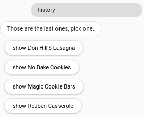
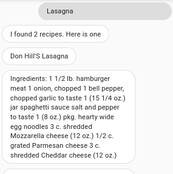
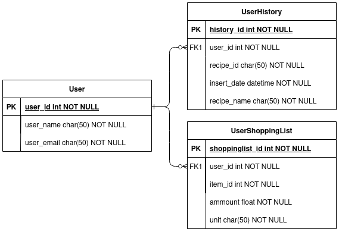

# 1. Chatbot development using Dialogflow CX, GCP and Atlas (JUNE/JULY/AUGUST 2023)

In this project a chatbot is developed using: 
- Dialogflow CX
- GCP Cloud Functions (python, functioning as webhooks)
- GCP BigQuery
- MongoDB Atlas  

The chatbot can recommend recipes to the user based on ingredients, that are left in the users fridge or pantry.
This way those ingredients ([eggs, banana]) don't go to waste. The bot can also recommend recipes based on the name (lasagna) or the category (vegan).

The recommended recipes are being displayed to the user with the name of the recipe, list of ingredients and the instructions to make the recipe. 

The dialogflow chatbot was/is not integrated with any system, it was tested with the test console, available at:  
https://dialogflow.cloud.google.com/cx

 

# What can the Chatbot do?

- give recipe recommendations bases on category
- give recipe recommendations bases on name of the recipe 
- give recipe recommendations bases on ingredients to be used
- give random recipe recommendations
    - convert measurements of the recommended recipe (cup to g / oz to ml)
    - change portion of the recipe (ni : whould need to extrace mesurements from text feelds , this whould need a language model for this)
    - add the ingredients of the recipe to a shopping list
    - reroll, to show another recipe that matches the query 

 

- convert independent measurements (without having a recommended recipe)
    - change portion of the converted measurement

 

- show the user the lase four recipes, that they viewed
    - if one is selected the user is shown the ingredients and the instructions

 

During the development the user experience(UX) was one of the key factory for the design.
For this, multiple people were consulted on the problems that they are having, when looking up recipes on the internet.
It was also assumed that the chatbot would be a standalone Project. This is one of the reasons, why the history was implemented in the flow.
Please note, that the Shopping list was an afterthought, and does not play into the "standalone project" idear.

 

## How could a conversations look like?

| User wants a new recipe             | User wants recipe from history           |
|-------------------------------------|------------------------------------------|
|        |        |
|     | |
|    |                                          |
|    |                                          |
| |                                          |

# Chatbot structure in Dialogflow CX

### Most of the "end flow", "end session", and some changes to other flows where not modeled, because it made the diagrams confusing.

## Default Start Flow

## Recipe

## Recipe History

| Shopping List                     | Convert Measurement                     |
|-----------------------------------|-----------------------------------------|
| | |

 

# 3. How does the architecture look like?

 

# Recipe data (MongoDB Atlas)

The recipes are mostly or entirely american (containing imperial measurements)  
The recipe data was saved in a database collection in MongoDB Atlas. This makes querying the data, which is in json format very easy.
The Json format was chosen, first and foremost because the original data was in json format. 
But also because it contains multiple array fields, like ingredients and directions. 

| name        | type       | description                                                                  |
|-------------|------------|------------------------------------------------------------------------------|
| _id         | ObjectId   | -> MongoDB id obj                                                            |
| title       | str        | -> name of the recipe                                                        |
| ingredients | array[str] | -> list of ingredients                                                       |
| directions  | array[str] | -> list of instruction to make the recipe                                    |
| link        | str        | -> link to the website hosting the recipe                                    |
| source      | str        | -> how the data point was found (mostly "Gathered")                          |
| NER         | array[str] | -> short form of ingredient without measurements                             |

 

## Dataset links

Recipes : https://eightportions.com/datasets/Recipes/#fn:1 

 

# History (GCP BigQuery)

In the history the last four recipes, that a specific user viewed are saved. 
The history works by saving up to four entries per user. The entries are identified by there "user_id" and a "datetime". When inserting a new recipe into the History, all entry that are older then the top four are deletes for that specific user.

Please note, that it is possible to have more than four entries per user. This is because the queries for inserting and deleting new entries are run at the same time. The webhook does not wait for them to finish, this would slow down the answer time of the bot and intern would decrease the UX. 

| name        | type       | description                                                                  |
|-------------|------------|------------------------------------------------------------------------------|
| recipe_id   | str        | -> str of MongoDB id obj                                                     |
| recipe_name | str        | -> name of the recipe                                                        |
| user_id     | str        | -> id of the user (only "example_user_id")                                   |
| datetime    | datetime   | -> time of insertion (when was the user shown this recipe)                   |

 

# How does the user data look like?

<strong> In short, it does not really exist! </strong>

However the history works by saving up to 4 entries per user. The entries are identified by there "user_id" and a timestamp. 

For every entry in the BigQuery table of the recipe history, the same "user_id" is used ("example_user_id"). This means that there are only entries for one user.  
The goal of this project was not to build a implementation ready chatbot. It serves more like a concept. This is why no BigQuery table containing user data was created/generated. 
Please note, that I am not aware of any possibility to provide Dialogflow CX (without integration) with data, that is not given in a text request, like a user_id. which would be necessary to query a database. 
If the bot was integrated into a system, the user could login and the system would get the user_id this way. 

### Optimal BigQuery structure

Note, that the user_id could also be replaced by user_email. 

 

# What would make the chatbot better?

Currently, the chatbot is not able to convert measurements from one unit to another (e.g., cup to g, oz to ml).
This functionality would require extracting measurements from text fields, which would need a language model specifically trained for this task. 
Similarly, the chatbot also doesn't support changing the portion size of a recipe or adding the ingredients to a shopping list. 
While it might be possible to extract the measurements using brute force, I anticipate that this approach would be prone to mistakes.

The querying by category is currently not implemented in the chatbot due to the absence of category information in the recipe data.
However, it might be possible to infer certain categories based on the ingredients of a recipe, such as identifying recipes as 'vegan' based on the absence of animal products.
Additionally, it should be noted that some recipes could also be made 'vegan' by substituting certain ingredients.

 

# Why use Dialogflow CX and not Dialogflow ES

- More features: Dialogflow CX offers more advanced features compared to Dialogflow ES. It provides enhanced capabilities for building complex conversational flows and managing stateful conversations.
- Better graphs: Dialogflow CX provides improved visual representation of conversation flows through its graph-based interface. This makes it easier to design and understand the structure of conversations.
- Better collaboration capabilities: While collaboration is possible in both Dialogflow ES and CX, collaboration in Dialogflow CX is enhanced by the fact that developers can write and test webhook code simultaneously.
  In ES, it is only possible to use one webhook.

It is also worth noting that Dialogflow ES offers a free tier with limited usage, while Dialogflow CX is a paid service.
However, Dialogflow CX provides a free trial with a $600 credit that is valid for one year.
It's important to mention that Cloud Functions, used as a webhooks, are not included in either version's trial.

 
